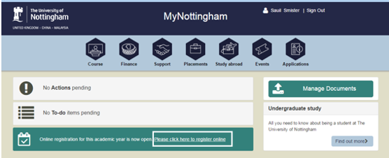
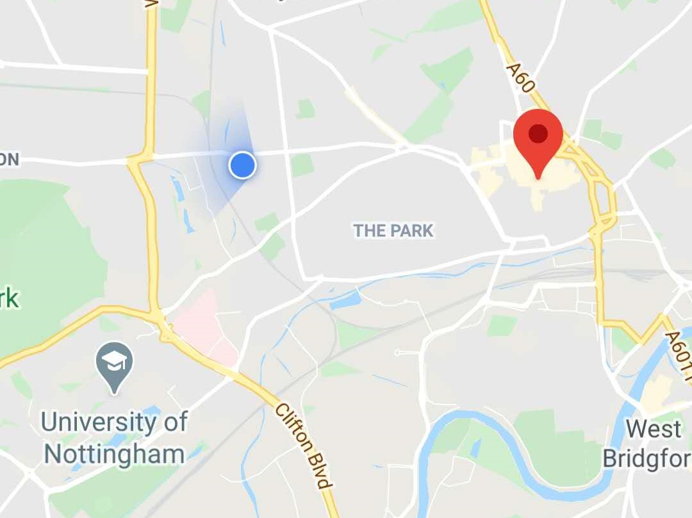

<!-- 
Author:     Kejia Wu
Version:    1.1
Email:      kobenorriswu@gmail.com
-->

# 到校（英）报到

## 1. 线上报到 -- Online Registration

* 开始时间：9月3日（左右）

* 通知方式：邮件通知

* 必要材料：学生账户（记得更新密码）

* 报到方式：[MyNottingham](https://mynottingham.nottingham.ac.uk) 线上报到

* 报到流程：

    登录 [MyNottingham](https://mynottingham.nottingham.ac.uk) 并点击线上报到 (Online Registration)，后按提示完成线上注册

    

    (邮件原件就这么糊，凑合看看吧)

----

## 2. 线下报到 -- Attendance Confirmation

* 开始时间：完成线上报到后

* 通知方式：邮件通知

* 必要材料：原 UNNC 学生卡，护照，

* 报到方式：受疫情影响，待通知，可关注 [官网](https://www.nottingham.ac.uk/studentservices/servicedetails/registration/attendance-confirmation.aspx) 发布后续细节

* 报到流程：受疫情影响，待通知，可关注 [官网](https://www.nottingham.ac.uk/studentservices/servicedetails/registration/attendance-confirmation.aspx) 发布后续细节（个人猜测会转线上，video conference）

----

## 3. 警局注册 -- Police Registration

* 开始时间：9月初，需预约

* 通知方式：领取 BRP 时通知

* 必要材料：护照，BRP，住房合同，2寸证件照，缴费小票

* 报到方式：线下，Park 校区 Cherry Tree Lodge，需预约

* 报到流程：

    首先于巴克莱银行缴费，保存小票，下附较近一家巴克莱银行的地址
    
    详细地址：Barclays Bank, 2 High St, Nottingham NG1 2EN, UK （Google Map 请输入详细地址查询）

    
    
    于线上预约时间携所需材料前往 [Cherry Tree Lodge](https://www.nottingham.ac.uk/currentstudents/international-students/index.aspx) 注册

    

    （见 Building 13，红色 block 圈出，较小）

